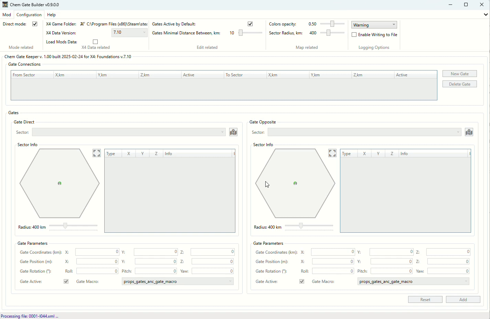

# X4 Chem Gate Builder

This tool allows you to build gate connections for the game X4 Foundations. It helps players create connections between any sectors in the game. The tool generates a mod (extension) for the game, which can be easily installed and uninstalled.

## Features

- Build gate connections between any sectors in the game.
- Select sectors from a list or from the Galaxy map.
- Create any number of connections, where a connection is a pair of gates in two sectors.
- Easily arrange the location of gates in sectors by moving them on the map using the mouse.
- Easily rotate the gates in sectors by using the mouse.
- Direct mode - when you need only to select a game folder and start building connections. Nothing to extract.

## Disclaimer

Anyone can use the gate connections built by this tool in their mods or simply in the game.
If you use the connections in mods, please mention the author and the tool in the mod description.

## Download

You can download the tool from the following locations:

- [Releases on GitHub](https://github.com/chemodun/X4-UniverseEditor/releases)
- [Nexus](https://www.nexusmods.com/x4foundations/mods/1587/)

## Table of Contents

- [X4 Chem Gate Builder](#x4-chem-gate-builder)
  - [Features](#features)
  - [Disclaimer](#disclaimer)
  - [Download](#download)
  - [Table of Contents](#table-of-contents)
  - [Installation](#installation)
  - [Usage](#usage)
    - [Direct Mode](#direct-mode)
      - [Direct Mode First Start](#direct-mode-first-start)
      - [Direct Mode First Mod Creation](#direct-mode-first-mod-creation)
      - [Direct Mode Second and Other starts](#direct-mode-second-and-other-starts)
      - [Direct Mode To Usual Mode and Vice Versa](#direct-mode-to-usual-mode-and-vice-versa)
    - [First Start](#first-start)
    - [With Extracted Game Files](#with-extracted-game-files)
    - [Without Extracted Game Files](#without-extracted-game-files)
      - [Loading the Mods with the Game Data and DLC's](#loading-the-mods-with-the-game-data-and-dlcs)
        - [Data Loading Important Notice](#data-loading-important-notice)
    - [Main Window](#main-window)
      - [Connection Editing Area](#connection-editing-area)
        - [Direct Sector Selection and Simple Map](#direct-sector-selection-and-simple-map)
        - [Define Gate Location](#define-gate-location)
          - [Gate Rotation](#gate-rotation)
          - [Rotate gate by mouse](#rotate-gate-by-mouse)
        - [Gate orientation on a Galaxy Map](#gate-orientation-on-a-galaxy-map)
        - [Extended Sector Map](#extended-sector-map)
        - [Sector "Real" Size Slider](#sector-real-size-slider)
        - [Other Gate Data](#other-gate-data)
      - [Opposite Sector Selection](#opposite-sector-selection)
      - [Add Gates Connection](#add-gates-connection)
      - [Modify Existing Connection](#modify-existing-connection)
      - [Connection Editing Area Buttons](#connection-editing-area-buttons)
        - [Reset Button](#reset-button)
      - [Map Objects Tooltips](#map-objects-tooltips)
      - [Galaxy Map](#galaxy-map)
        - [Clusters and sectors tooltips](#clusters-and-sectors-tooltips)
        - [Hiding and showing the DLC's and Mods on a map](#hiding-and-showing-the-dlcs-and-mods-on-a-map)
        - [Showing an empty cluster cells](#showing-an-empty-cluster-cells)
    - [Save the Mod](#save-the-mod)
    - [Load the Mod](#load-the-mod)
    - [Overview New Gates in the Tool and in the Game](#overview-new-gates-in-the-tool-and-in-the-game)
  - [Credits](#credits)
  - [Useful Links](#useful-links)
    - [EGOSOFT Forum](#egosoft-forum)
    - [GitHub Repository Issues Reporting](#github-repository-issues-reporting)
  - [License](#license)
  - [Changelog](#changelog)
    - [\[0.10.0\] - 2025-07-18](#0100---2025-07-18)
    - [\[0.9.7\] - 2025-07-18](#097---2025-07-18)
    - [\[0.9.6\] - 2025-03-14](#096---2025-03-14)
    - [\[0.9.5\] - 2025-03-05](#095---2025-03-05)
    - [\[0.9.4\] - 2025-03-04](#094---2025-03-04)
    - [\[0.9.3\] - 2025-02-28](#093---2025-02-28)
    - [\[0.9.2\] - 2025-02-25](#092---2025-02-25)
    - [\[0.9.0\] - 2025-02-24](#090---2025-02-24)
    - [\[0.8.9\] - 2025-02-20](#089---2025-02-20)
    - [\[0.8.8\] - 2025-02-17](#088---2025-02-17)
    - [\[0.8.6\] - 2025-02-14](#086---2025-02-14)
    - [\[0.8.5\] - 2025-02-14](#085---2025-02-14)
    - [\[0.8.4\] - 2025-02-14](#084---2025-02-14)
    - [\[0.8.3\] - 2025-02-14](#083---2025-02-14)
    - [\[0.8.2\] - 2025-02-13](#082---2025-02-13)
    - [\[0.8.1\] - 2025-02-13](#081---2025-02-13)
    - [\[0.8.0\] - 2025-02-13](#080---2025-02-13)
    - [\[0.7.0\] - 2025-02-11](#070---2025-02-11)
    - [\[0.6.0\] - 2025-02-10](#060---2025-02-10)
    - [\[0.5.2\] - 2025-02-08](#052---2025-02-08)
    - [\[0.4.3\] - 2025-01-14](#043---2025-01-14)

## Installation

Simply [download](#download) the latest version and extract it to any folder.

You can start building your connections right away.

## Usage

### Direct Mode

In the Direct Mode, you don't need to extract the game files. You just need to select the game folder and start building the connections.
In this case the tool will load the game data directly from the game files. And will work only with the "Chem Gate Keeper" mod in the game `Extensions` folder. You will be able only to save it, without possibility to select its location.

#### Direct Mode First Start

On the first start, the tool will inform you that you need to select the game folder, and will switch to the options menu tab.
If you will unselect `Direct Mode`- you will go via start process described below in the [First Start](#first-start) section.

After selecting the game folder, the tool will start loading the game data.

Available from `version 0.9.0`.

#### Direct Mode First Mod Creation

After loading the game data, you will see the main window and can start building the Gate connections.
When you will be finish with the connections, you can save the mod via the `Mod` -> `Save` menu item.
Mod will be saved in the game `Extensions` folder.

#### Direct Mode Second and Other starts

On the next starts tool will automatically load not only game data, but also the "Chem Gate Keeper" mod data. So, after starting you will see the main window with the connections from the mod.

You can update the connections, add new ones, or remove the existing ones. After that you can save the mod via the `Mod` -> `Save` menu item.

#### Direct Mode To Usual Mode and Vice Versa

At any time you can switch between the Direct Mode and the Usual Mode. Just go to the options menu and select or unselect the `Direct Mode` checkbox.
In some cases it will require to load the extracted game data again.

### First Start

On the first start, the tool will inform you that you need to select the folder with the game files.

If you will unselect the `Direct Mode` - you will go via the start process described below.

And when you press a button to select the folder, the tool will propose two ways to do it:

- Select the extracted game folder. If you already have it - simply press the "Yes" button.
- Extract the game files. If you don't have the game files extracted, you can press the "No" button to initiate the extraction.

### With Extracted Game Files

After selecting the folder, the tool will start loading the game data.

There is a link on wiki related to the tool for the extraction - [X Catalog Tool](https://wiki.egosoft.com:1337/X4%20Foundations%20Wiki/Modding%20Support/X%20Catalog%20Tool/).

### Without Extracted Game Files

You will be forwarded to the menu containing the button to start the extraction. Please press it to start the extraction.
Now everything is simple:

- Select the folder with the game files.
- Select the folder where will be placed new folder with the extracted game files. It will be created automatically with a name containing the current game version. Like "X4v710-extracted".
- Press the "Extract Data" button.

There are several options to extract the game files:

- Extract only needed data - this will extract only the data needed for the tool to work. It will be faster than the full extraction.
- Verify extracted data - this will check the consistency of the extracted data. Recommended to use it every time you extract the data.
- Overwrite existing files - this will overwrite the existing files in the output folder. Again, recommended to use it every time you extract the data.
- Set as source and load after extraction - this will set the extracted folder as the source for the game data and load it after the extraction.

Additionally, you can see unselect some DLC's, if you don't want to extract them.

#### Loading the Mods with the Game Data and DLC's

On the options page there is a checkbox which allows you to load the mods with the game data and DLC's. This is useful if you want to work with the mods in the tool. The mods will be loaded from the `extensions` folder in the game data. Can be extracted the same way as the game data and DCL's.

Available from `version 0.7.0`.
Updated in `version 0.8.1`.

##### Data Loading Important Notice

From `version 0.7.0` the tool requires the `content.xml` files for the DLC's and Mods in the extracted game data.
The tool will extract them automatically for DLC's. If you have an extracted data by previous version of a tool (before `v0.7.0`)- please repeat the process.

### Main Window

After starting, you will see the main window with a list of connections and an area to define a gate connection, i.e., two areas to define the gates in the two sectors.
The new gates are already shown on the map in the default position in the sector center.

#### Connection Editing Area

##### Direct Sector Selection and Simple Map

To start, simply select any sector from the list in the `Direct Sector` group.
Then the items from the selected sector will be displayed on the raw and simple sector map and as a list on the right side of the map.

Existing gates are displayed as yellow gate icons from the game. Gold ones are from the currently edited mod. Green represents the currently edited gate.
In addition, the SuperHighway gate and stations from the god.xml will be displayed.
The background of the sector map matches the color of the sector owner in the game.

##### Define Gate Location

You can define the gate location by pressing the left mouse button on the gate and moving it to the desired location.
A more precise position can be set by entering the coordinates and rotation angles.
Please note that the coordinates are split into two parts:

- Coordinates themselves, in km (this is the appropriate zone position in the sector).
- Position - the position from the coordinates point in meters (this is the position of the gate in the zone).

To simplify editing, the position part is randomly prefilled on sector selection.

###### Gate Rotation

The rotation of the gate can be defined using three angles: Yaw, Pitch and Roll.

**Pitch is the most important one**, as it defines the direction the gate is facing in the sector. Yaw and Roll are generally not needed for most cases, but can be used for specific scenarios.

Here is an explanation of each:

- **Yaw**: This is just the clockwise/counterclockwise rotation of the ring. A value of 90 would put the side pods of the ring at the top and bottom instead and so is also generally unnecessary and can be left at 0 in most cases.
- **Pitch**: This is the left/right rotation of the ring and is the one to actually use if you want to face the ring in a certain direction on the map. A Pitch of 0 degrees has the ring facing North and the connection line on the map coming out of the south side of the ring. +45 degrees has the ring turn right to face North-East with the map line going to the South-West. While ship traffic doesn't care which way the map line is facing, it does make the map a bit wild and unnecessarily cluttered if it's facing the wrong way. Also, you can't enter more than 180 degrees in the box, so if you want to face west you must use a negative value. And oddly, you can't type in a negative sign (-) without a value already in the box. For example, -135 would face the gate South-West with the map line going North-East.
- **Roll**: This is the forward/backward pitch of the gate and so is generally unneeded unless the gate is well above or below the plane of the sector. It can typically just be left at 0.

###### Rotate gate by mouse

You can rotate the gate by pressing and holding the right mouse button on the new gate icon on the map and moving the mouse around. Increasing the distance from the center of the gate will increase the rotation accuracy.

Available from `version 0.10.0`.

##### Gate orientation on a Galaxy Map

Orientation of the gate on the Galaxy Map is displayed by the Pitch angle.

Available from `version 0.10.0`.

##### Extended Sector Map

If the current sector map size is too small for you, you can press the appropriate button to open the extended sector map.
On this map, you can set the gate location in the same way as on the simple map, but more precisely.

##### Sector "Real" Size Slider

Under the sector map, there is a slider to change the sector map "real" size. This is effectively the scale of the sector map.

##### Other Gate Data

You can define rotation angles for the gate and set the status of the gate. For some reason, you can deactivate it (if you plan to use it in your own scenarios).

#### Opposite Sector Selection

Now you can select the second sector and define the gate location in it.

Please note that in the selection list for the second (`Opposite Sector`), some sectors will be grayed out and not available for selection. This is because the sector is already selected as the first sector or they already have a connection with the `Direct Sector`.

After defining the gate in the second sector, you can add the connection to the list.

#### Add Gates Connection

Simply press the `Add` button.

The connection will be added to the list. You can see the connection in the list and still edit it.

#### Modify Existing Connection

If you move the gate in the sector for the existing connection, you will see two "identical" gates on the map.
One (`gold`) is the gate from the connection, and the other (`green`) is the gate in the new location.

#### Connection Editing Area Buttons

There are two buttons at the bottom of the window:

- `Add/Update` - to add the gate connection to the list. We already discussed it.
- `Reset` - to reset the gate data fields to the default values. See below for more information.

##### Reset Button

If you have no selected gate connection in the list, the reset button will reset all gate connection-related information to the defaults, mostly empty or zero values.

Otherwise, it will reset the gate data fields to the values of the selected connection.

#### Map Objects Tooltips

You can hover over the map objects to view additional information about them, such as their status, coordinates, and related connections. This feature helps in better understanding the relationships between different gates and sectors.

#### Galaxy Map

The Galaxy Map allows you to navigate through various sectors in the game. You can zoom in and out to view details about each sector and the gates within them. Using the map, you can select sectors to use in the gate connections.

For zooming, there are two options available:

- Use the slider at the top of the map.
- Use the mouse wheel while holding the `Ctrl` key.

Additionally, you can drag the map with the left mouse button when it is zoomed in.

When you click the left mouse button on a sector, it will be selected as the direct or opposite sector in the connection. If the selected sector is not available for the connection, like grayed-out sectors in the dropdown lists, the tool will do nothing.

Note: If you cannot see the sector you need on a map, but is is available in the list - it is probably because the located in cluster which coordinates cannot be aligned to the hexagonal grid. It will be a possible problem in appropriate Mod or DLC.

##### Clusters and sectors tooltips

You can hover over the clusters and sectors on the map to view additional information about them:

- For clusters you can see a name, macro and coordinates.
- For sectors you can see a name, owner, sunlight, economy, security, macro and coordinates. Additionally information about parent cluster is shown.

Available from `version 0.8.0`.

##### Hiding and showing the DLC's and Mods on a map

You can toggle the visibility of DLCs and Mods on the map to focus on your current editing tasks. This feature allows you to clearly see the connections you are working on without distractions from additional content. Use the map options menu to show or hide these elements according to your needs.

Available from `version 0.8.0`.

##### Showing an empty cluster cells

You can toggle the visibility of empty cluster cells on the map. This feature allows you to see the empty cells where a new cluster can be placed. Use the map options menu to show or hide these elements according to your needs. Additionally, you will have the possibility to see the coordinates of such cells on the appropriate tooltip.

### Save the Mod

When you finish with the connections, you can save the mod via the `Mod` -> `Save` menu item. Please ensure you have completed all necessary edits before saving to avoid losing data. If the connections are not finalized, the save option may be disabled.

Please note that if you have not finished editing the connections, this menu item will be disabled. Save the current connection or reset it to have the ability to save the mod.

After selecting the `Save` menu item, the tool will ask you to select the output folder for the mod.

After that, the mod is ready to be installed in the game.

### Load the Mod

If you have a previously saved mod, you can load it via the `Mod` -> `Load` menu item.
The difference from saving the mod is that you have to select the `content.xml` file in the mod root folder in contrast to selecting the output folder.
This was made to avoid selecting the wrong folder.

After loading the mod, you will see the connections in the list and the gates on the map for the first connection. This visibility confirms the successful loading of the mod and aids in verifying the gate configurations.

### Overview New Gates in the Tool and in the Game

There is a short overview of the mod in the tool to see the gate locations.

Here are several screenshots from the game with the mod gates in the `Asteroid Belt` sector.

## Credits

- [EGOSOFT](https://www.egosoft.com) - for the game itself (In fact - for the series of games)!
- Members of the [x4_modding discord channel](https://discord.com/channels/337098290917146624/502057640877228042) - for the answers, support, ideas and inspiration!
- [SiliconStew](https://steamcommunity.com/profiles/76561198005610231) - for the documentation of the Gate Rotation specifics!

## Useful Links

### EGOSOFT Forum

There is a topic on the [EGOSOFT forum](https://forum.egosoft.com/viewtopic.php?p=5262362) about the tool. You can ask questions, share your thoughts, or provide feedback there.

### GitHub Repository Issues Reporting

Please report any issues or bugs encountered while using the tool. You can submit your reports through the [GitHub repository Issues](https://github.com/chemodun/X4-UniverseEditor/issues). Your contributions help improve the tool for everyone!

## License

This project is licensed under the Apache License 2.0 - see the [LICENSE](../../LICENSE) file for details.

## Changelog

### [0.10.0] - 2025-07-18

- Added
  - Expose gate orientation on Sector and Galaxy Maps
  - Gate rotation by mouse on the Sector map

### [0.9.7] - 2025-07-18

- Fixed
  - Fixed the issue with the extracting the files Egosoft catalogs with UTF-8 BOM
- Improved
  - Improved the extraction window by rearranging the controls and "all" options for the DLC's and Mods
  - Improved logging for the Clusters which is not processing during the Map building, if their coordinates cannot be aligned to the hexagonal grid

### [0.9.6] - 2025-03-14

- Fixed
  - Creating a gate in Sectors defined only by diff files (specifics of some Mods)

### [0.9.5] - 2025-03-05

- Fixed
  - Ignore doubles in clusters/sectors
- Improved
  - Tool tips for the clusters and sectors
  - Mods version is shown in the Galaxy map

### [0.9.4] - 2025-03-04

- Fixed
  - Loading non-standard colors for the fractions
  - Loading displaying the huge sectors with its content
  - Scale slider on the Galaxy map
- Improved
  - Sector scaling on Sector map

### [0.9.3] - 2025-02-28

- Added
  - Possibility to work with custom universe id
- Improved
  - Improved gate coordinates, position and rotation angles input
  - Debug log readability

### [0.9.2] - 2025-02-25

- Fixed
  - Fixed the issue with the loading the mod made by tool, introduced in `v0.8.8`
  - Loading the diffs from mod will not be interrupted by the error
  - Fixed mod loading order logic based on dependencies

### [0.9.0] - 2025-02-24

- Added
  - `Direct Mode` to simplify the tool usage
- Improved
  - Procedures to work with EGOSOFT catalogs

### [0.8.9] - 2025-02-20

- Added
  - Hyperion pack DLC support
- Fixed
  - Fixed the issue with broken `content.xml` file after mod edit

### [0.8.8] - 2025-02-17

- Fixed
  - Fixed the issue with the loading created mods to the game - "case" issue
- Improved
  - Internal procedure of game data loading

### [0.8.6] - 2025-02-14

- Fixed
  - Fixed the issue with the mod loading to the tool

### [0.8.5] - 2025-02-14

- Updated
  - Documentation

### [0.8.4] - 2025-02-14

- Added
  - "Save As" option for the mod
- Improved:
  - Tooltips for the map objects
- Fixed
  - Mod changes detection logic

### [0.8.3] - 2025-02-14

- Refactor
  - Changed internal logic of data loading (XMLPatch)

### [0.8.2] - 2025-02-13

- Fixed
  - Fixed the extraction window behavior

### [0.8.1] - 2025-02-13

- Improved
  - Mods can be extracted with the game data and DLC's

### [0.8.0] - 2025-02-13

- Added
  - Clusters and sectors tooltips
  - Hiding and showing the DLC's and Mods on a map
  - Showing empty cluster cells (with coordinates on the tooltip)

### [0.7.0] - 2025-02-11

- Added
  - Working with Mods, not only DLC's
- Changed
  - DLC's and Mods `content.xml` files are now required in extracted files
  - They are extracted automatically.
- Warning
  - **Please repeat the extraction process if you have already extracted the game files**

### [0.6.0] - 2025-02-10

- Added
  - Extraction game files

### [0.5.2] - 2025-02-08

- Added
  - Galaxy Map
  - A lot all other small stuff...

- Refactor
  - Rewritten from Python to C# to avoid false positive virus detection

- Removed
  - Console version is gone

### [0.4.3] - 2025-01-14

- Added
  - Initial public version
