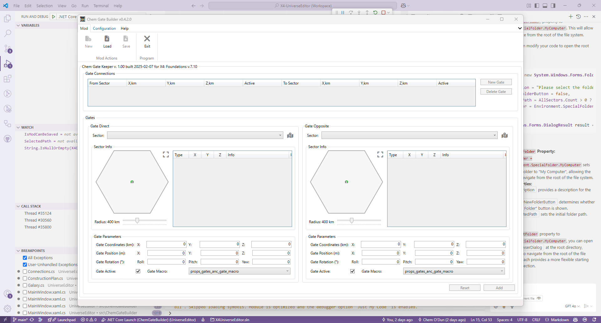

# X4 Chem Gate Builder

There is a tool to build gate connections for the game X4 Foundations. This tool has been created to help players to build connection between any sectors in the game. This tool creates a mod (extension) for the game, which can be installed and uninstalled easily.

## Features

- Build gate connections between any sectors in the game.
- Select the sector from the list of the sectors or from the Galaxy map.
- You can build any number of connections, where the connection - it is a pair of the gates in two sectors.
- You can easily arrange the location of the gates in the sectors by moving them on the map using the mouse.

## Disclaimer

Anybody can use built gate connections in his own mods.
With appropriate credits to the tool and the author.

## Requirements

    You have to have the extracted game files in your computer by the [X Catalog Tool](https://wiki.egosoft.com:1337/X4%20Foundations%20Wiki/Modding%20Support/X%20Catalog%20Tool/)

## Installation

Simple download the latest version of the tool from the [Nexus](https://www.nexusmods.com/x4foundations/mods/1587/) and extract it to any folder.

You can start to build your connections right away.

## Usage

### First start
On first start, the tool will inform you that you have to select the extracted game folder.

After you will select the folder, the tool will start to load the game data.

### Main window

After you start you will see the main window with the list of the connections and area to define a gate connection - i.e. two areas to define the gate in the two sectors.
The new gates already shown on the map int he default position in the sector center.

#### Connection editing area

##### First sector selection and simple map

To start, simple select any sector from the list in the `Direct Sector` group.
Then the items from the selected sector will be displayed on the raw and simple sector map and as a list on the right side from the map

Existing gates displayed as a yellow gate icons from the game. Gold ones - from th currently edited mod. Green - the currently edited gate.
In addition the SuperHighway gate and stations from the god.xml will be displayed.
Background of the sector map is equal to the color of sector owner in the game.

##### Define gate location

Then you can define the gate location.
Simplest way - to press the left mouse button on the gate and move it to the desired location.
More strict position can be set by entering the coordinates and rotation angles.
Please take in account that the coordinates are split into two parts:
[list]
 - coordinates itself, in km. (De facto it is the appropriate zone position in the sector),
 - position - the position of from the coordinates point in meters. (De facto it is the position of the gate in the zone).
[/list]
To simplify the editing the position part is randomly prefilled on the sector selection.

##### Extended sector map

If current sector map size is too small for you, you can press the appropriate button to open the extended sector map.
On this map you can set the gate location in the same way as on the simple map, but more precisely.

##### Sector "real" size slider

Under the sector map there is a slider to change the sector map "real" size. De facto it is the scale of the sector map.

##### Other gate data

Then you can define a rotation angles for the gate.

And set the status of the gate - for some reason you can deactivate it (if you plan to use it in your own scenarios).

#### Second sector selection

Now you can select the second sector and define the gate location in it.

Please take in account that the in selection list for the second (`Opposite Sector`) some sectors will be grayed out and not available for the selection. It's because the sector is already selected as a first sector or they already have a connection with the `Direct Sector`.

After you will define the gate in the second sector, you can add the connection to the list.

#### Add gates connection

Simple press the `Add` button.

The connection will be added to the list. You can see the connection in the list and still can edit it.

#### Modify existing connection

If you will move the gate in the sector for the existing connection - you will see two "identical" gates on the map.
One (`gold`) - is the gate from the connection, another (`green`) - is the gate in the new location.

Additionally, as you can see, each gate have a tooltip on the map with the sector name, to which it connects current sector, source (from `map` or from `mod`) and the X,Y,Z coordinates.

#### Connection editing area buttons

As you can see, there are two buttons on the bottom of the window:
[list]
- `Add/Update` - to add the gate connection to the list. We already discussed it.
- `Reset` - to reset the gate data fields to the default values. See below for more information.
[/list]

##### Reset button

If you have no selected gate connection in the list - reset button will reset all gate connection related information to the defaults, mostly empty or zero values.

Otherwise, it will reset the gate data fields to the values of the selected connection.

### Save the mod

When you will finish with the connections, you can save te mod via `Mod` -> `Save` menu item.

Please take in account - you you not finished yet editing the connections, this menu item will be disabled.
Save current connection or reset it to have the ability to save the mod.

After you will go to the `Save` menu item, the tool will ask you to select the output folder for the mod.

After that the mod is ready to be installed in the game.

### Load the mod

If you have a previously saved mod, you can load it via `Mod` -> `Load` menu item.
Difference from the saving mod - you have to select not a mod folder, but the `content.xml` file in the mod root folder.
It was made to avoid selecting not a mod folder, but the mod itself.

After loading the mod, you will see the connections in the list and the gates on the map. But no current connection will be selected.

### Overview mod in a tool and in the game

There a gif to display the mod gates and compare it with a screenshots from the game.

And there a several screenshots from the game with the mod gates in the `Asteroid Belt` sector.

## Additional links

There is a topic on the [Egosoft forum](https://forum.egosoft.com/viewtopic.php?p=5262362) about the tool.