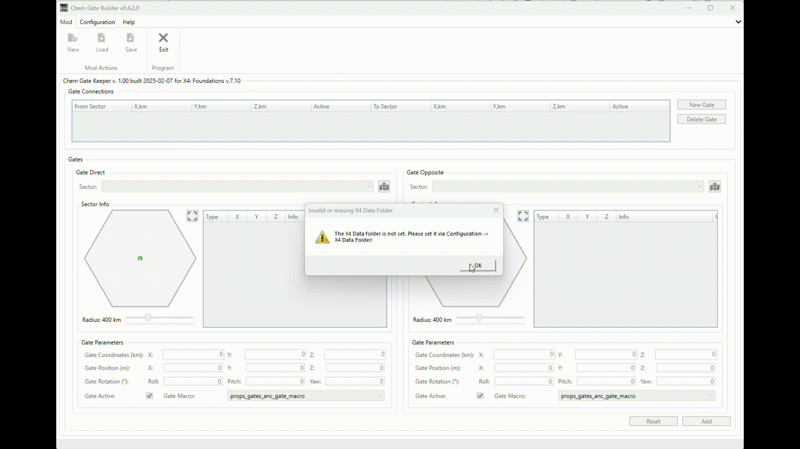
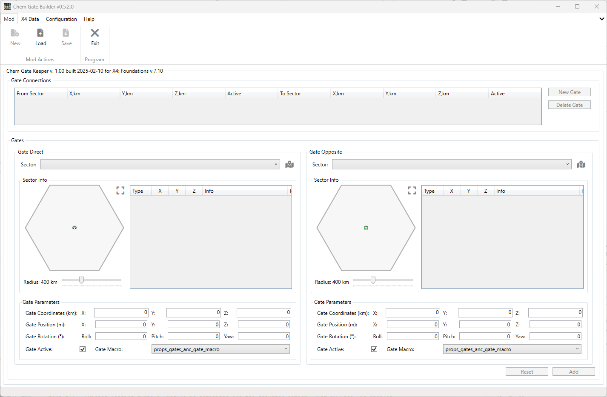
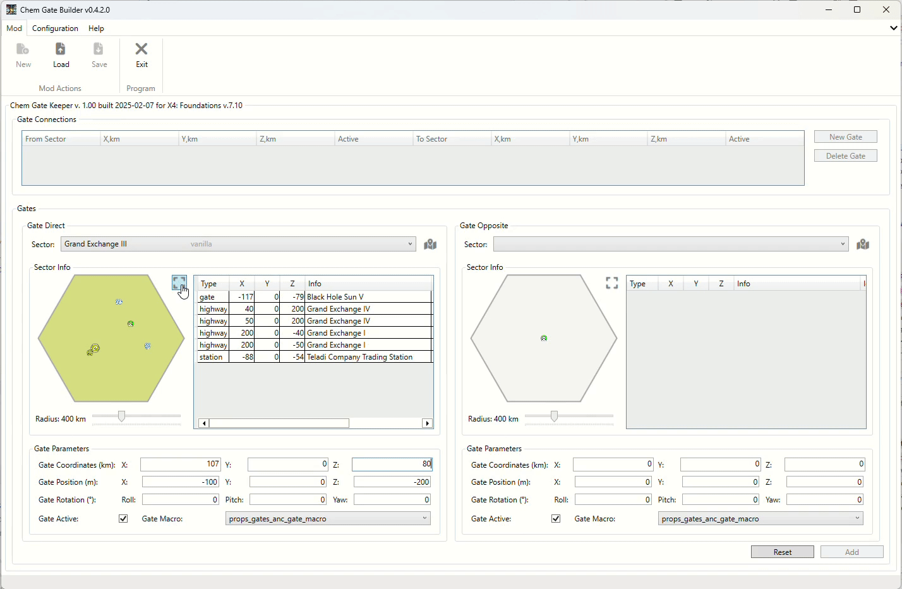
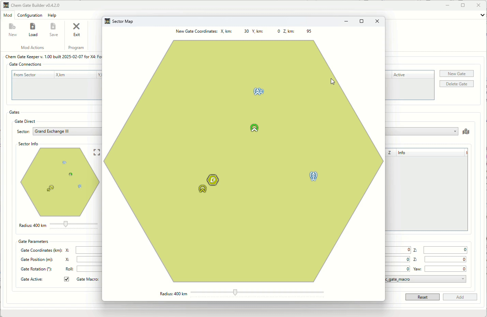
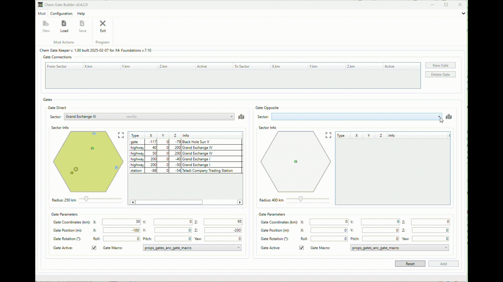
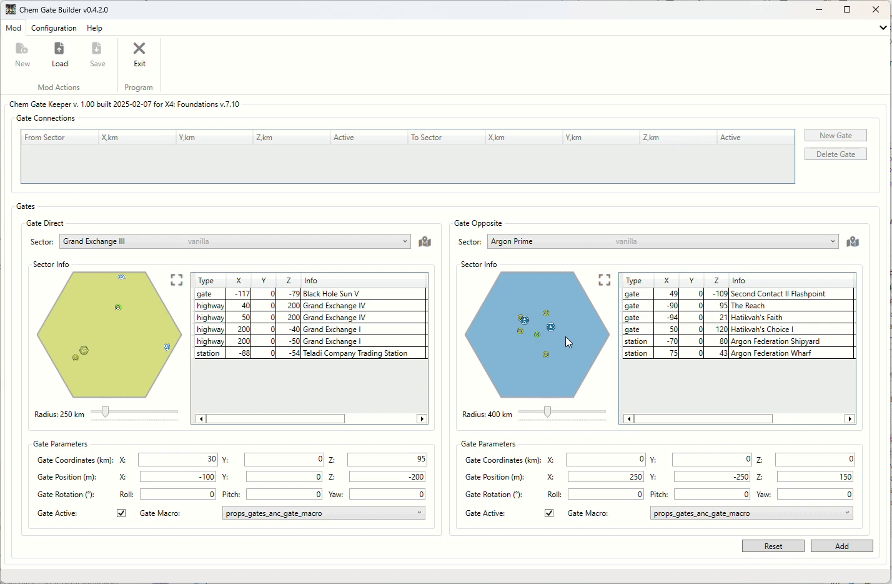
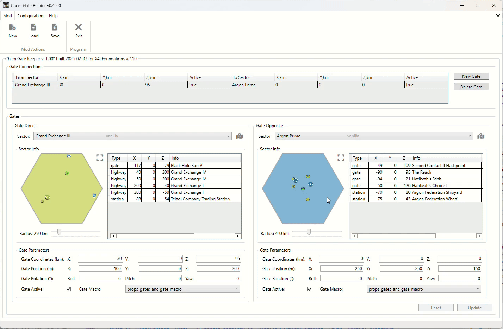
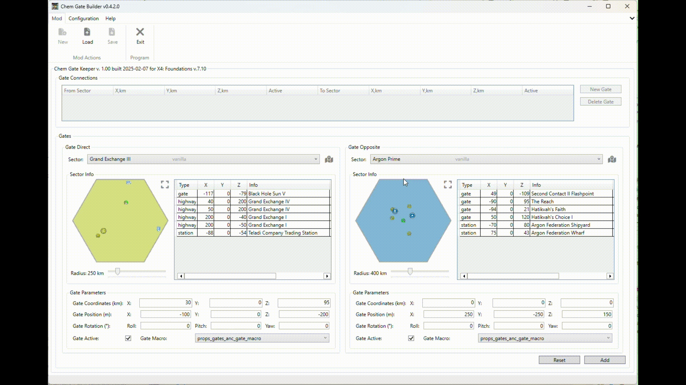
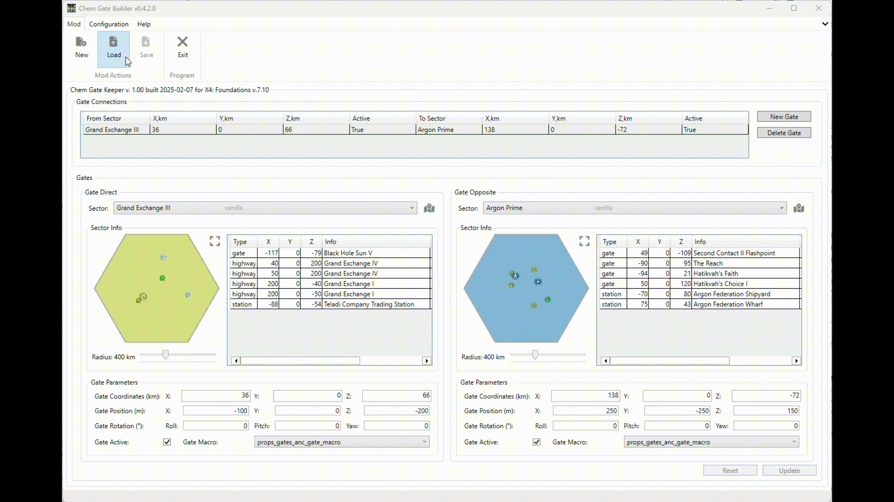

# X4 Chem Gate Builder

This tool allows you to build gate connections for the game X4 Foundations. It helps players create connections between any sectors in the game. The tool generates a mod (extension) for the game, which can be easily installed and uninstalled.

## Features

- Build gate connections between any sectors in the game.
- Select sectors from a list or from the Galaxy map.
- Create any number of connections, where a connection is a pair of gates in two sectors.
- Easily arrange the location of gates in sectors by moving them on the map using the mouse.

## Disclaimer

Anyone can use the gate connections built by this tool in their mods or simply in the game.
If you use the connections in mods, please mention the author and the tool in the mod description.

## Requirements

You need to have the extracted game files on your computer using the [X Catalog Tool](https://wiki.egosoft.com:1337/X4%20Foundations%20Wiki/Modding%20Support/X%20Catalog%20Tool/).

## Download

You can download the tool from the following locations:

- [Releases on GitHub](https://github.com/chemodun/X4-UniverseEditor/releases)
- [Nexus](https://www.nexusmods.com/x4foundations/mods/1587/)

## Installation

Simply [download](#download) the latest version and extract it to any folder.

You can start building your connections right away.

## Usage

### First Start

On the first start, the tool will inform you that you need to select the folder with the [extracted](#requirements) game files.

After selecting the folder, the tool will start loading the game data.

### Main Window

After starting, you will see the main window with a list of connections and an area to define a gate connection, i.e., two areas to define the gates in the two sectors.
The new gates are already shown on the map in the default position in the sector center.

#### Connection Editing Area

##### First Sector Selection and Simple Map

To start, simply select any sector from the list in the `Direct Sector` group.
Then the items from the selected sector will be displayed on the raw and simple sector map and as a list on the right side of the map.

Existing gates are displayed as yellow gate icons from the game. Gold ones are from the currently edited mod. Green represents the currently edited gate.
In addition, the SuperHighway gate and stations from the god.xml will be displayed.
The background of the sector map matches the color of the sector owner in the game.

##### Define Gate Location

You can define the gate location by pressing the left mouse button on the gate and moving it to the desired location.
A more precise position can be set by entering the coordinates and rotation angles.
Please note that the coordinates are split into two parts:

- Coordinates themselves, in km (this is the appropriate zone position in the sector).
- Position - the position from the coordinates point in meters (this is the position of the gate in the zone).

To simplify editing, the position part is randomly prefilled on sector selection.

##### Extended Sector Map

If the current sector map size is too small for you, you can press the appropriate button to open the extended sector map.
On this map, you can set the gate location in the same way as on the simple map, but more precisely.

##### Sector "Real" Size Slider

Under the sector map, there is a slider to change the sector map "real" size. This is effectively the scale of the sector map.

##### Other Gate Data

You can define rotation angles for the gate and set the status of the gate. For some reason, you can deactivate it (if you plan to use it in your own scenarios).

#### Second Sector Selection

Now you can select the second sector and define the gate location in it.

Please note that in the selection list for the second (`Opposite Sector`), some sectors will be grayed out and not available for selection. This is because the sector is already selected as the first sector or they already have a connection with the `Direct Sector`.

After defining the gate in the second sector, you can add the connection to the list.

#### Add Gates Connection

Simply press the `Add` button.

The connection will be added to the list. You can see the connection in the list and still edit it.

#### Modify Existing Connection

If you move the gate in the sector for the existing connection, you will see two "identical" gates on the map.
One (`gold`) is the gate from the connection, and the other (`green`) is the gate in the new location.

#### Connection Editing Area Buttons

There are two buttons at the bottom of the window:

- `Add/Update` - to add the gate connection to the list. We already discussed it.
- `Reset` - to reset the gate data fields to the default values. See below for more information.

##### Reset Button

If you have no selected gate connection in the list, the reset button will reset all gate connection-related information to the defaults, mostly empty or zero values.

Otherwise, it will reset the gate data fields to the values of the selected connection.

#### Map Objects Tooltips

You can hover over the map objects to view additional information about them, such as their status, coordinates, and related connections. This feature helps in better understanding the relationships between different gates and sectors.

#### Galaxy Map

The Galaxy Map allows you to navigate through various sectors in the game. You can zoom in and out to view details about each sector and the gates within them. Using the map, you can select sectors to use in the gate connections.

For zooming, there are two options available:

- Use the slider at the top of the map.
- Use the mouse wheel while holding the `Ctrl` key.

Additionally, you can drag the map with the left mouse button when it is zoomed in.

When you click the left mouse button on a sector, it will be selected as the direct or opposite sector in the connection. If the selected sector is not available for the connection, like grayed-out sectors in the dropdown lists, the tool will do nothing.

### Save the Mod

When you finish with the connections, you can save the mod via the `Mod` -> `Save` menu item.

Please note that if you have not finished editing the connections, this menu item will be disabled.
Save the current connection or reset it to have the ability to save the mod.

After selecting the `Save` menu item, the tool will ask you to select the output folder for the mod.

After that, the mod is ready to be installed in the game.

### Load the Mod

If you have a previously saved mod, you can load it via the `Mod` -> `Load` menu item.
The difference from saving the mod is that you have to select the `content.xml` file in the mod root folder in contrast to selecting the output folder.
This was made to avoid selecting the wrong folder.

After loading the mod, you will see the connections in the list and the gates on the map for the first connection. This visibility confirms the successful loading of the mod and aids in verifying the gate configurations.

### Overview New Gates in the Tool and in the Game

There is a short overview of the mod in the tool to see the gate locations.

Here are several screenshots from the game with the mod gates in the `Asteroid Belt` sector.

## Useful Links

### EGOSOFT Forum

There is a topic on the [EGOSOFT forum](https://forum.egosoft.com/viewtopic.php?p=5262362) about the tool. You can ask questions, share your thoughts, or provide feedback there.

### GitHub Repository Issues Reporting

Please report any issues or bugs encountered while using the tool. You can submit your reports through the [GitHub repository Issues](https://github.com/chemodun/X4-UniverseEditor/issues). Your contributions help improve the tool for everyone!
