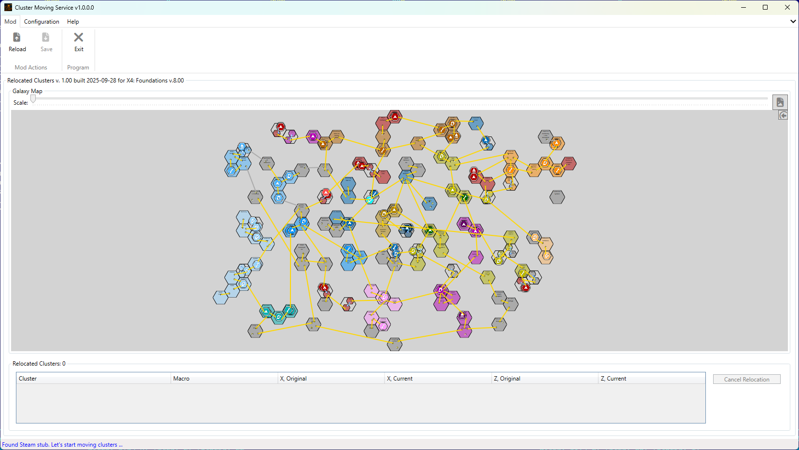
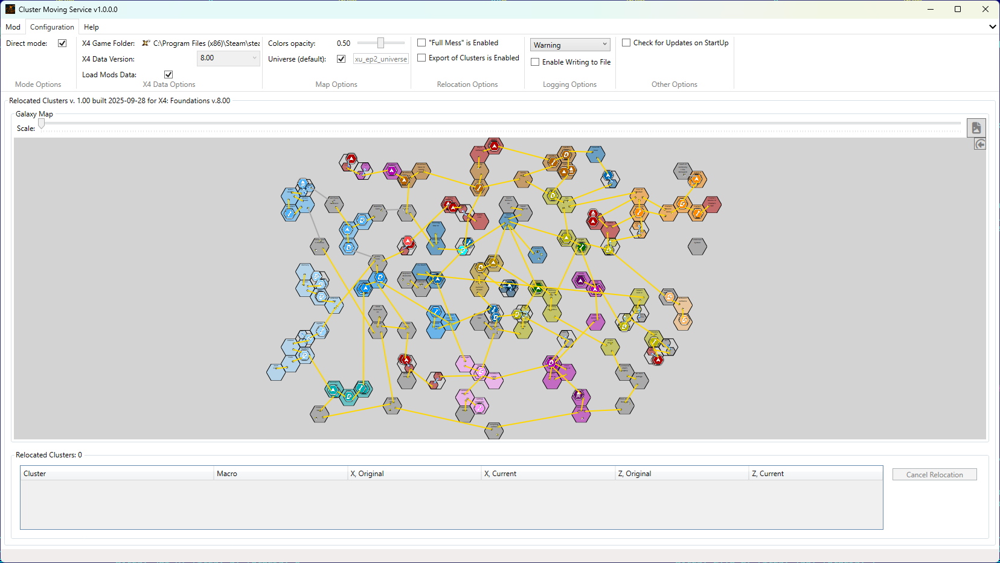

# X4 Cluster Relocation Service

**Transform the entire Galaxy with a single click!**

This tool allows you to relocate clusters in the X4: Foundations game universe. It provides a user-friendly interface to select clusters, define new locations, and update the game data accordingly.

After relocating clusters, you can save the changes as a mod (`Relocated Clusters`) that can be easily loaded into the game.

**If you tired of to play in nasty known galaxy - simple press a button, and you will not find any sector on a map :-)**

In addition to the Cluster per Cluster relocation, the tool also allows you to `Make a "Full Mess"` in the galaxy by relocating all clusters in one go to random locations.

It based on funny "hidden" feature of the game engine, which allows you to define or breaks new locations of the clusters without any influence on a game stability and processes. The relocation mod is not affecting on you save games, so you can safely remove/change it at any time.

## Features

- User-friendly interface for selecting and relocating clusters.
- Has no make you game dependant on a `Relocated Clusters` mod. Simply remove it and continue to play as usual.
- Ability to define new locations for clusters.
- Option to relocate all clusters randomly in one go.
- Validation of new locations to ensure they are valid within the game universe.
- Can be used to resolve the issue with overlaid clusters, when several clusters have equal coordinates.
- Can be used by modders to simplify relocation of their clusters.
- Dedicated overlaid clusters browser with at-a-glance visibility highlighting and double-click map centering.

## Disclaimer

Anyone can use the new Clusters location export in their mods.
If you use the connections in mods, please mention the author and the tool in the mod description.

## Download

You can download the tool from the following locations:

- [Nexus](https://www.nexusmods.com/x4foundations/mods/1835)
- [Releases on GitHub](https://github.com/chemodun/X4-UniverseEditor/releases)

## Installation

Simply download the latest version and extract it to any folder.

You can place it anywhere on your computer, as it doesn't require installation.

## Video on YouTube

There is a video on YouTube demonstrating the tool's features and results in the game:

- [X4 Cluster Relocation Service - Demo](https://www.youtube.com/watch?v=_pJWPhHJ-zw)
- [X4 Cluster Relocation Service - In-game map after "Full Mess"](https://www.youtube.com/watch?v=htOmHchP6es)
- [X4 Cluster Relocation Service - Flying via Highway Ring after "Full Mess"](https://www.youtube.com/watch?v=pgoBqIiB7sk)
- [X4 Cluster Relocation Service - Resolving Overlaid Clusters Issue](https://www.youtube.com/watch?v=-iil3PYGCD4)
- [X4 Cluster Relocation Service - Overlaid Clusters List](https://www.youtube.com/watch?v=mNKfgAUDcDo)

## Usage

### Direct Mode

In the Direct Mode, you just need to select the game folder and start playing with the Clusters relocation.
In this case the tool will load the game data directly from the game files.
The mod will be saved in the game `Extensions` folder, under `relocated_clusters` folder.

#### Direct Mode First Start

On the first start, the tool will inform you that you need to select the game folder, and will switch to the options menu tab.
If you will unselect `Direct Mode` - you will go via start process in "Expert" mode: [First Start in the "Expert" Mode](#first-start-in-the-expert-mode) section.

After selecting the game folder, the tool will start loading the game data.

#### Direct Mode First Mod Creation

After loading the game data, you will see the main window and the Galaxy Map.
Please take in account - the Sectors ownership is equal to the initial game state, without any changes from the current save.
When you will be finish with the connections, you can save the mod via the `Mod` -> `Save` menu item.
Mod will be saved in the game `Extensions` folder, under `relocated_clusters` folder.

#### Direct Mode Second and Other starts

On the next starts tool will automatically load not only game data, but also the "Relocated Clusters" mod data. So, after starting you will see the the map with the already relocated clusters.

You can cancel the existing relocation, or add new, or relocated already relocated clusters.

After that you can save the mod via the `Mod` -> `Save` menu item.

#### Direct Mode To "Expert" Mode and Vice Versa

At any time you can switch between the Direct Mode and the "Expert" Mode. Just go to the options menu and select or unselect the `Direct Mode` checkbox.
Always will reload the game data and the mod data. Please take in account - in "Expert" Mode you have manually specify the mod location. And moreover, in "Expert" Mode you will work with extracted game files, not with the game files directly.

### Main Window

After starting, you will see the main window with a Galaxy Map.

#### Galaxy Map

The Galaxy Map allows you to navigate through various sectors in the game. You can zoom in and out to view details about each sector and the gates within them. Using the map, you can select sectors to use in the gate connections.

For zooming, there are two options available:

- Use the slider at the top of the map.
- Use the mouse wheel while holding the `Ctrl` key.

Additionally, you can drag the map with the left mouse button when it is zoomed in.

When you click the any mouse button on a Cluster(or Sector) - it will show the `Context Menu` with the options to `Mark for Relocation` or `Cancel Relocation` (if the cluster is already relocated).

If there any overlaid clusters (clusters that occupy the same space) - they will be highlighted by `OrangeRed` border on the map.

##### Relocating a Cluster

To relocate a cluster, you have to make a two-step process:

###### Marking a Cluster for Relocation

To relocate a cluster, simply click on the desired cluster on the Galaxy Map and select `Mark for Relocation` from the context menu. This action will mark the cluster for relocation, and it will be highlighted on the map.
In addition, the cell grid will be shown on the map to help you visualize the new location.

###### Overlaid Clusters

If there are any overlaid clusters (clusters that occupy the same space), they will be highlighted by `OrangeRed` border on the map. Context menu item `Mark for Relocation` will show as visible on map cluster, as well as a list of underlying clusters below it.

###### Choosing a New Location

After marking a cluster for relocation, click on the desired empty cell on the map where you want to move the cluster. And again, a context menu will appear. Select `Relocate Here` to move the cluster to the new location.

###### Magic

And that's it! The cluster will be relocated to the new position, and the map will update to reflect the change.
Cluster will be marked by Blue border on the map.

Previously  relocated cluster will be marked by Green border on the map.

###### Unmark a Cluster

If you change your mind and decide not to relocate a cluster, simply click on the marked cluster again and select `Unmark for Relocation` from the context menu. This action will unmark the cluster.

Or simply `Mark` any other cluster - the previously marked one will be unmarked automatically.

##### Canceling a Relocation

If you want to revert a relocation and return a cluster to its original position, click on the relocated cluster and select `Cancel Relocation` from the context menu. This action will move the cluster back to its initial location.

Please note that if the original position is already occupied by another cluster, the cancellation will not be possible. And this menu item will be disabled.

#### Relocated Clusters List

On the bottom of the main window, there is a list of relocated clusters. This list provides an overview of all clusters that have been relocated, including their names, macro ids, original and new coordinates.

##### Canceling a Relocation from the List

To cancel a relocation from the list, simply select the desired cluster in the list and click the `Cancel Relocation` button located right next to the list. This action will revert the selected cluster to its original position.

##### Focusing on the Map from the List

To focus on a specific relocated cluster on the map, select the desired cluster in the list and the border of the selected item will be highlighted on the map as in a list.

##### Exporting the map to the image file (png)

You can export the current view of the Galaxy Map to a PNG image file. This feature allows you to save and share the map view with others or use it for reference in your projects. To export the map, simply click the "Export Galaxy Map as PNG" button located at the top right corner of the Galaxy Map interface.

Thanks to [@Sleaker](https://steamcommunity.com/id/sleaker) for the idea and initial implementation for the [Chem Gate Builder](https://www.nexusmods.com/x4foundations/mods/1587/) mod.

##### Hiding and showing the DLC's and Mods on a map

You can toggle the visibility of DLCs and Mods on the map to focus on your current editing tasks.

Please note that only hiding the Clusters and Sectors from the view, but not removing them from the game data. You will not able relocate the Clusters on the positions occupied by the hidden ones.

### Full Mess Relocation

You can enable or disable the "Full Mess" option, which allows you to relocate all clusters randomly in one go.
When enabled, you will see a button `Make a "Full Mess"` under the `Cancel Relocation` button, in the right side of the relocated clusters list.

When you press it, all clusters will be relocated one by one to random cells on the map.

### Save the Mod

When you finish with the connections, you can save the mod via the `Mod` -> `Save` menu item. Please ensure you have completed all necessary edits before saving to avoid losing data.
After that, the mod will be saved/updated in the appropriate subfolder in the `Extensions` folder of the game.
And can be used immediately after loading the game.

### Reload the Mod

If you want to break current changes at once, before they are saved - and revert to a previously saved version, you can load it via the `Mod` -> `Reload` menu item.

### Tabs under the Galaxy Map

Under the Galaxy Map, there are two tabs: "Relocated Clusters" and "Overlaid Clusters".

#### Relocated Clusters Tab

The **Relocated Clusters** tab is a primary interface for managing clusters that have been moved from their original positions. All controls related to relocated clusters are located here.

#### Overlaid Clusters Tab

The **Overlaid Clusters** tab provides a consolidated list of cells that host multiple clusters. Entries that are currently visible on the galaxy map are shown in **semi-bold**, making it easy to spot which ones are rendered in the current view. Double-click any row to immediately center and possibly zoom-in the map on that cluster.

### Configuration

#### Mode Options

##### Direct Mode Checkbox

Already described above in the [Direct Mode](#direct-mode) section.

#### X4 Data Options

##### Game Folder Selection

You need to select the folder where the game is installed. This is typically the folder where the game's executable file (`X4.exe`) is located.

You can change it any time by pressing the current folder path text.

##### X4 Data Version

Mostly to show which game version is currently selected.

##### Load Mods Data

You can toggle the loading of mods along with the game data and DLCs. This is useful if you want to work with mods in the tool. The mods will be loaded from the `extensions` folder in the game folder.
Enabled by default.
Not recommended to unselect it. You can be in trouble if will place the relocated cluster on the position occupied by the modded one.

Please note that loading the mods will not make your `Relocated Clusters` mod dependant on them. It will depend only on the DLC's and Mods which are contains the clusters you are relocating.

#### Map Options

##### Color Opacity

You can adjust the opacity of the colors used in the map to suit your preferences. This setting allows you to make the map more visually appealing or easier to read based on your needs.

##### Universe ID

You can specify a custom universe ID to work with a different game universe. This is useful if you are working with mods that create their own universes or if you want to test changes in a separate environment.

##### Relocation Options

###### Full Mess is Enabled

You can enable or disable the `Make a "Full Mess"` button visibility, which allows you to relocate all clusters randomly in one go.

Disabled by default.

###### Export of Clusters is Enabled

You can enable or disable the export of relocated clusters as a full clusters connection list, which can be used in mods.

Disabled by default.

#### Logging Options

##### Log Level

You can set the log level to control the verbosity of the logging output. This is useful for debugging or monitoring the tool's operations.

##### Enable writing to File

You can enable or disable writing log output to a file. This is useful for keeping a record of the tool's operations for later review or troubleshooting.

#### Other Options

##### Check for Updates on StartUp

You can enable or disable the automatic check for updates when the tool starts. This ensures you are always using the latest version of the tool with the newest features and bug fixes.

### "Expert" Mode

#### First Start in the "Expert" Mode

On the first start, the tool will inform you that you need to select the folder with the game files.

If you will unselect the `Direct Mode` - you will go via the start process described below.

And when you press a button to select the folder, the tool will propose two ways to do it:

- Select the extracted game folder. If you already have it - simply press the "Yes" button.
- Extract the game files. If you don't have the game files extracted, you can press the "No" button to initiate the extraction.

##### With Extracted Game Files

After selecting the folder, the tool will start loading the game data.

There is a link on wiki related to the tool for the extraction - [X Catalog Tool](https://wiki.egosoft.com:1337/X4%20Foundations%20Wiki/Modding%20Support/X%20Catalog%20Tool/).

##### Without Extracted Game Files

You will be forwarded to the menu containing the button to start the extraction. Please press it to start the extraction.
Now everything is simple:

- Select the folder with the game files.
- Select the folder where will be placed new folder with the extracted game files. It will be created automatically with a name containing the current game version. Like "X4v800-extracted".
- Press the "Extract Data" button.

There are several options to extract the game files:

- Extract only needed data - this will extract only the data needed for the tool to work. It will be faster than the full extraction.
- Verify extracted data - this will check the consistency of the extracted data. Recommended to use it every time you extract the data.
- Overwrite existing files - this will overwrite the existing files in the output folder. Again, recommended to use it every time you extract the data.
- Set as source and load after extraction - this will set the extracted folder as the source for the game data and load it after the extraction.

Additionally, you can unselect some DLC's or Mods, if you don't want to extract them.

##### Reloading the Game Data

If you need to reload the game data, especially if the Mod or DLC was updated (for example, if you are mod developer, and want to know how the galaxy map will look after your changes) - you can do it via the `X4 Data` -> `Reload` menu item.

## Credits

- [EGOSOFT](https://www.egosoft.com) - for the game itself (In fact - for the series of games)!
- Members of the [x4_modding discord channel](https://discord.com/channels/337098290917146624/502057640877228042) - for their answers, support, ideas, and inspiration!

## Useful Links

### EGOSOFT Forum

There is a topic on the [EGOSOFT forum](https://forum.egosoft.com/viewtopic.php?p=?????) about the tool. You can ask questions, share your thoughts, or provide feedback there.

### GitHub Repository Issues Reporting

Please report any issues or bugs encountered while using the tool. You can submit your reports through the [GitHub repository Issues](https://github.com/chemodun/X4-UniverseEditor/issues). Your contributions help improve the tool for everyone!

## License

This project is licensed under the Apache License 2.0 - see the [LICENSE](../../LICENSE) file for details.

## Changelog

### [1.3.1] - 2025-11-25

- Fixed
  - Issue with count() in XPath.
  - Leading zeros in page and text IDs in Translations.

### [1.3.0] - 2025-10-21

- Added
  - Overlaid Clusters tab with at-a-glance visibility highlighting and double-click map centering.

### [1.2.0] - 2025-10-06

- Added
  - Ability to work with underlying clusters (clusters that hidden under other, when occupy the same space).
- Fixed
  - Disabled Mods influenced on sorting order
  - SymLinks used by Vortex Mod Manager not processed right
  - Some other minor bugs

### [1.1.0] - 2025-09-28

- Added
  - Initial public version
